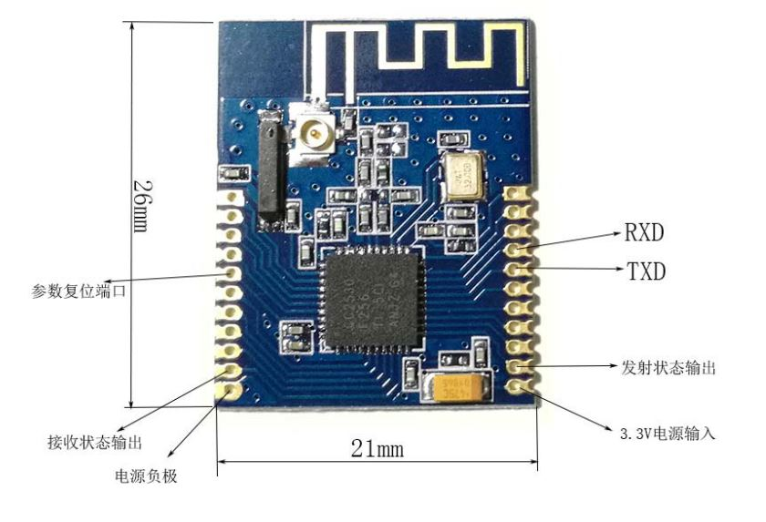

# 毕业设计

## 接线图:

## ZigBeeMaster踩坑记录:
- 如果在GroupBox中修改了波特率,并点击设置为协调器/路由器后,会显示读取失败,此时在基础设置处修改为指定波特率即可
- 所有波特率下拉栏中的300,600,1200,43000,56000为无效参数

## ZigBee模块:
- No1
  - 115200 8 N 1
  - PAN ID:00 01
  - channel 11
  - short address:00 01
- No2
  - 115200 8 N 1
  - PAN ID:00 01
  - channel 11
  - short address:00 02

